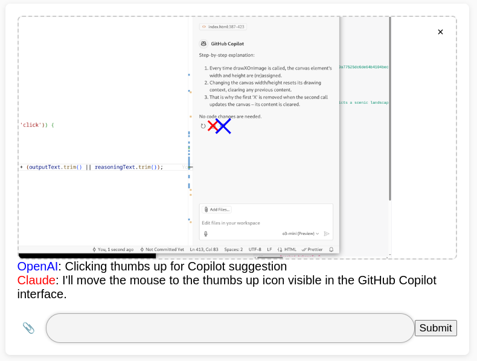

# Pi-C (Picture Coordinate Finder)

A simplistic interactive web app where you can upload images and then ask to find specific coordinates within the image. Powered by Anthropic's Claude API and new Computer Use functions. (Also largely coded by Claude Sonnet 3.5)



## Setup

1. Clone the repository
2. Install dependencies:
```bash
pip install -r requirements.txt
```
3. Create a `.env` file in the root directory and add your Anthropic API key:
```bash
ANTHROPIC_API_KEY=your_api_key_here
```
4. Run the application:
```bash
python app.py
```
5. Open http://localhost:8008 in your browser

## Usage

1. Upload an image by:
   - Dragging and dropping
   - Clicking the paperclip icon
   - Pasting from clipboard (Ctrl/Cmd + V)

2. Type a natural language query like:
   - "Where is the button?"
   - "Find the logo"
   - "Point to the menu icon"

3. Press Enter or click Submit to process your request

4. The application will:
   - Mark the location with a red X
   - Provide a text response about the location

## Technical Details

- Frontend: Vanilla JavaScript with modern DOM APIs
- Backend: Flask (Python)
- Image Processing: Pillow library
- AI: Claude 3 Sonnet with computer vision capabilities
